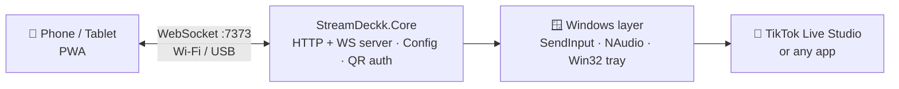

<h1 align="center">Hi, I'm Esat Taha Polat 👋</h1>

  

  
  
  

---

### 🚀 About me

- 🔭 Building **[StreamDeckk](https://github.com/tahap0l/Streamdeckk)**, which turns any phone or tablet into a Stream Deck for live streaming
- 🧪 I ship things end to end: code, end-to-end tests, CI on real Windows machines and an installer
- 🌐 Building web apps and PWAs with HTML, CSS and JavaScript
- 🌱 Currently exploring **mobile development** and **AI / data**
- 💬 Ask me about **C#, .NET, WebSockets, PWAs** and Windows automation

<b>🇹🇷 Türkçe</b>

 

- 🔭 Herhangi bir telefonu ya da tableti yayın için Stream Deck'e dönüştüren **[StreamDeckk](https://github.com/tahap0l/Streamdeckk)** üzerinde çalışıyorum
- 🧪 Projeleri baştan sona çıkarıyorum: kod, uçtan uca testler, gerçek Windows makinelerinde CI ve kurulum dosyası
- 🌐 HTML, CSS ve JavaScript ile web uygulamaları ve PWA'lar geliştiriyorum
- 🌱 Şu sıralar **mobil geliştirme** ve **yapay zeka / veri** öğreniyorum
- 💬 **C#, .NET, WebSocket, PWA** ve Windows otomasyonu hakkında konuşabiliriz

---

### 🟣 Spotlight: StreamDeckk

  
  
  

Turn your phone into a stream controller. No App Store, no extra hardware: a single Windows exe in the system tray and a PWA on the phone.

- ⌨️ **Hotkeys** (F13–F24, never clash with real keys) · 🔊 **soundboard** with effects synthesized in code · ✍️ **text macros** · 🔁 **toggle keys**
- 🔒 **QR pairing** with a secret token; the control panel only opens on `127.0.0.1`
- 📶 **Wi‑Fi + USB** with automatic failover
- ✅ Every push is built on a **real Windows runner**: self-test (types Turkish text via `SendInput` and reads it back), single-instance check, E2E tests (API, WebSocket, Playwright) and automatic releases

  <a href="https://github.com/tahap0l/Streamdeckk/releases/latest"><b>⬇ Download</b></a> ·
  <a href="https://github.com/tahap0l/Streamdeckk"><b>Source code</b></a> ·
  <a href="https://tahap0l.github.io/#streamdeckk"><b>Try the live demo</b></a>

---

### 🛠️ Tech stack

    
  

  
  
  
  
  

---

### 📌 Projects

| Project | What it does | Built with |
|---|---|---|
| 🟣 **[StreamDeckk](https://github.com/tahap0l/Streamdeckk)** | Turns a phone or tablet into a Stream Deck for live streaming. Windows tray app with an installer, PWA front end, CI on real Windows. | C# · .NET 8 · WebSocket · PWA · Playwright · GitHub Actions |
| 💜 **[tahap0l.github.io](https://github.com/tahap0l/tahap0l.github.io)** | Bilingual portfolio with an interactive StreamDeckk demo (sounds synthesized with Web Audio) and live GitHub data. | HTML · CSS · JavaScript · GitHub Pages |

---

  <i>"Make it work, make it right, make it fast."</i>

